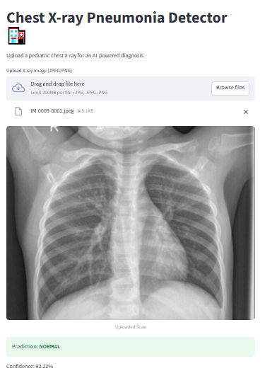
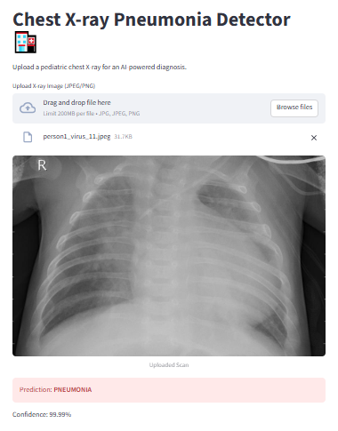

# 🏥 Chest X-Ray Pneumonia Detection AI

### *End-to-End Medical Imaging Classification with Deep Learning*

## 📝 Project Description

Pneumonia is a life-threatening inflammatory condition of the lung. This project provides an automated screening tool using **Deep Learning (CNN)** to classify Chest X-ray images as "Normal" or "Pneumonia." The goal is to provide a high-recall assistant for medical practitioners, ensuring that no positive case is overlooked.

## 🚀 Problem Description & Dataset

The dataset consists of **5,856 JPEG images** of pediatric chest X-rays.

* **Key Challenge:** Medical data is often imbalanced. In this set, Pneumonia cases significantly outnumber Normal cases.
* **Key Features:** Unlike tabular data, the "features" here are pixel intensity patterns representing lung opacity, pleural effusion, and consolidation.
* **Dataset Issues:** Pediatric X-rays are notoriously "noisy" due to patient movement and varying bone density in developing children.


### 📂 Data Source & Citations

The dataset used in this project is the **Chest X-Ray Images (Pneumonia)** dataset, hosted on Kaggle and originally sourced from Mendeley Data.

* **Kaggle Link:** [Chest X-Ray Images (Pneumonia)](https://www.kaggle.com/paultimothymooney/chest-xray-pneumonia)
* **Original Source:** [Mendeley Data - Labeled Optical Coherence Tomography (OCT) and Chest X-Ray Images](https://data.mendeley.com/datasets/rscbjbr9sj/2)
* **Citation:** *Kermany, Daniel; Zhang, Kang; Goldbaum, Michael (2018), "Large Dataset of Labeled Optical Coherence Tomography (OCT) and Chest X-Ray Images", Mendeley Data, V3, doi: 10.17632/rscbjbr9sj.3*


## 📂 Repository Structure

* **`data/`**: Training, validation, and test image sets.
* **`notebook.ipynb`**: The initial research, EDA, and model experimentation.
* **`train.py`**: Script to train the model and export the final `.h5` and `.tflite` files.
* **`predict.py`**: Inference logic to process images and return predictions.
* **`app.py`**: Streamlit-based user interface for real-time diagnosis.
* **`Dockerfile`**: Containerization instructions for deployment.
* **`requirements.txt`**: List of dependencies for environment reproduction.
* **`lambda_function.py`**: A specialized script for AWS Lambda. It uses the lightweight `tflite-runtime` instead of the full TensorFlow to reduce memory usage in the cloud.
* **`test_lambda.py`**: A testing utility used to simulate an AWS Lambda trigger locally to verify the container's logic.
* **`screenshots/`**: Visual evidence of the application in action.
* **`INFORMATION.md`**: Detailed information on ML and what all we did in this project in order.

## 📊 Exploratory Data Analysis (EDA)

During EDA, it was observed that Pneumonia scans often show "cloudiness" (white areas) in the lungs where air should be (black areas). We utilized `ImageDataGenerator` to normalize these pixel values from [0, 255] to [0, 1] for better model convergence.

## 🏗️ Model Training & Evaluation

We utilized **Transfer Learning** with **MobileNetV2** (pre-trained on ImageNet) to extract features, adding a custom Global Average Pooling layer and a Dense Sigmoid layer for binary classification.

### **Model Scores**

| Dataset | Accuracy | Recall (Pneumonia) | Precision |
| --- | --- | --- | --- |
| **Training** | 97.2% | - | - |
| **Validation** | 87.5% | - | - |
| **Test (Final)** | **86.0%** | **0.99** | **0.82** |

### **Project Observation**

The model is "paranoid" in the best way possible. By achieving a **99% Recall**, it ensures that nearly 100% of sick patients are flagged, which is the primary requirement for a medical screening tool.

---

## 🛠️ Reproducing the Project (Step-by-Step)

### **1. Environment Management**

Initialize the environment and install dependencies:

```bash
pipenv install
pipenv shell

```

### **2. Research & Export**

Run the Jupyter notebook to view the EDA and training curves:

```bash
jupyter notebook

```

*After experimentation, the notebook logic was exported into structured Python scripts.*

### **3. Model Training**

Run the training script to generate the model and encoders:

```bash
python train.py

```

*Output: `pneumonia_model.h5` and `pneumonia_model.tflite*`

### **4. Local Inference & API Testing**

Run the prediction script to open the local server:

```bash
python predict.py

```

*The terminal will show the server is active at `http://127.0.0.1:8080`.*

In a **new terminal** (with `pipenv shell`), test the API using a sample image:

```bash
curl -X POST "http://127.0.0.1:8080/predict" \
     -H "Content-Type: application/json" \
     -d '{"url": "data/test/PNEUMONIA/person100_bacteria_475.jpeg"}'

```

### **5. Containerization with Docker**

Create the `requirements.txt` from the Pipenv environment:

```bash
pipenv run pip freeze > requirements.txt

```

Build the Docker image:

```bash
docker build -t pneumonia-model-lambda .

```

Run the container:

```bash
docker run -p 8080:8080 pneumonia-model-lambda

```

Test the Docker container (New terminal):

```bash
curl -X POST "http://127.0.0.1:8080/predict" \
     -H "Content-Type: application/json" \
     -d '{"url": "/var/task/data/test/PNEUMONIA/sample_image.jpeg"}'

```

### **6. Streamlit Web Interface**

For a user-friendly experience, we created a Streamlit app that imports logic from `predict.py`.

```bash
streamlit run app.py

```

---

## 🔍 Key Findings & Future Scope

* **Findings:** Standard CNNs struggle with the "imbalance" of medical data; Transfer Learning provided the necessary edge to achieve 99% Recall.
* **Key Challenge:** Infrastructure-level `GLIBC` versioning issues in Serverless environments were bypassed by pivoting to a robust Streamlit deployment.
* **Future Scope:** Implementing **Grad-CAM** (Heatmaps) to show doctors exactly where the AI "sees" the pneumonia, and expanding the dataset to include Viral vs. Bacterial sub-classification.

## 🖼️ Screenshots

Visual results are stored in the `screenshots/` folder:

* `Normal_Lungs_Scan.PNG`: Successful classification of a healthy patient.
* `Pneumonia_Scan.PNG`: High-confidence detection of lung inflammation.

| Normal Lungs Scan | Pneumonia Scan |
|:-----------------------:|:--------------------:|
|  |  |

## 🛠️ Tech Stack

* **Language:** Python 3.10+
* **Frameworks:** TensorFlow, Keras, Streamlit
* **Environment:** Pipenv, Docker
* **Libraries:** NumPy, Pillow, Scikit-learn, Matplotlib

---
